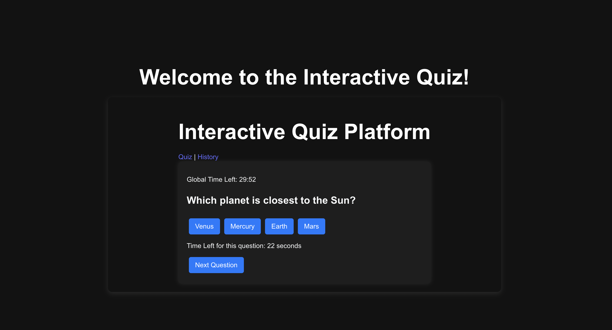
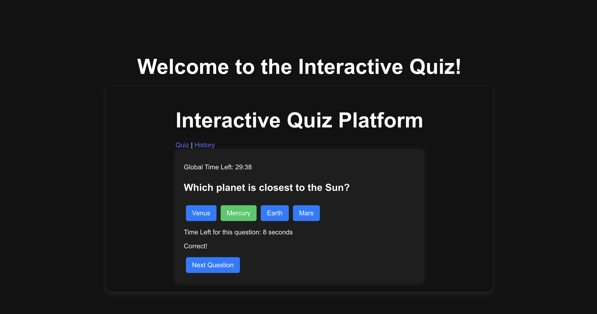
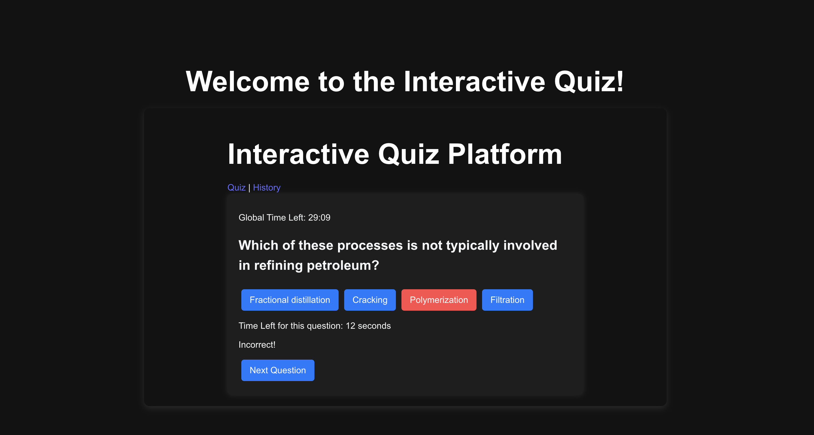
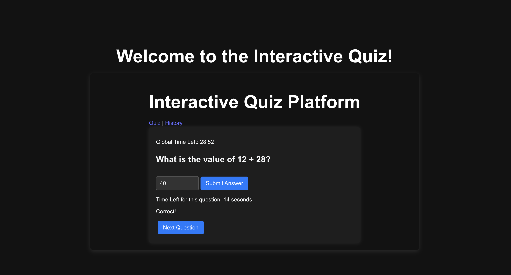
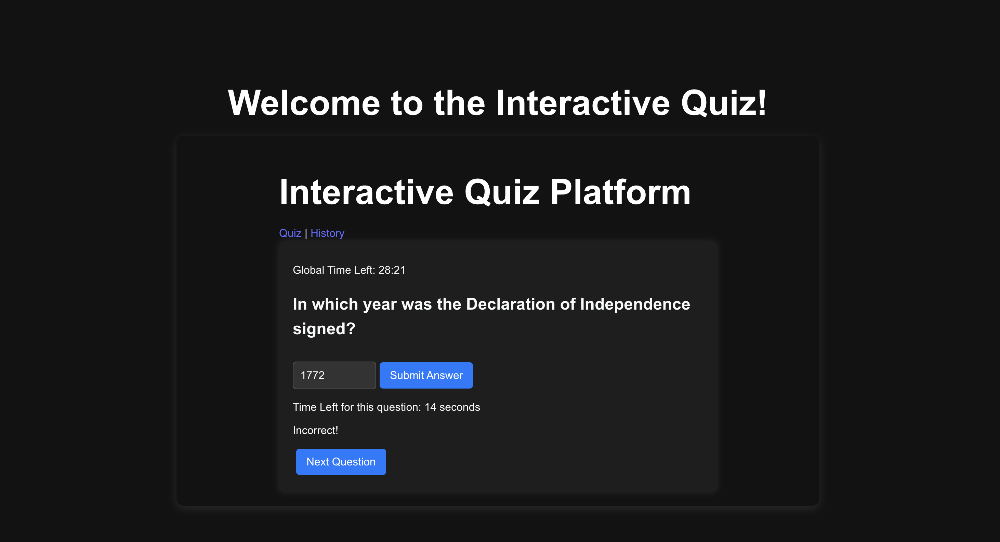
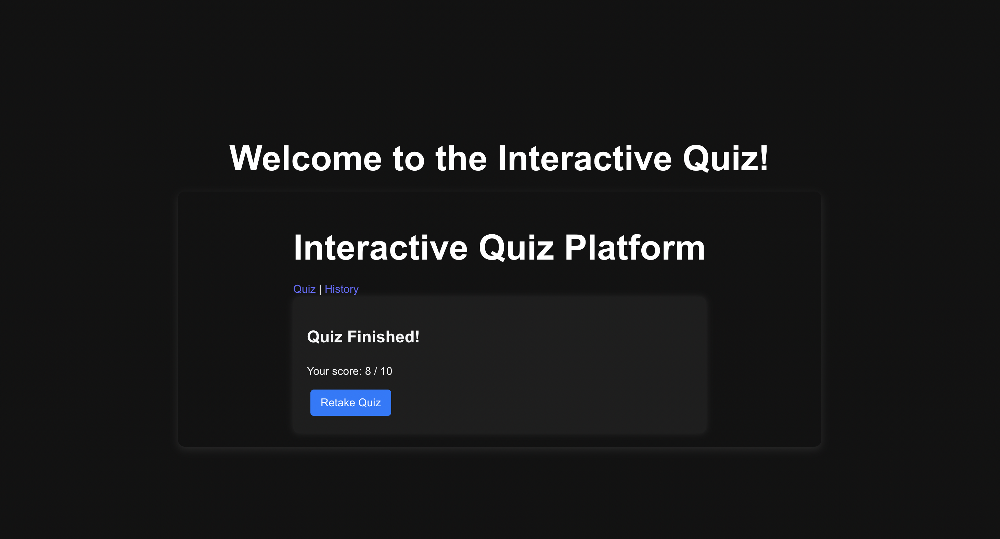
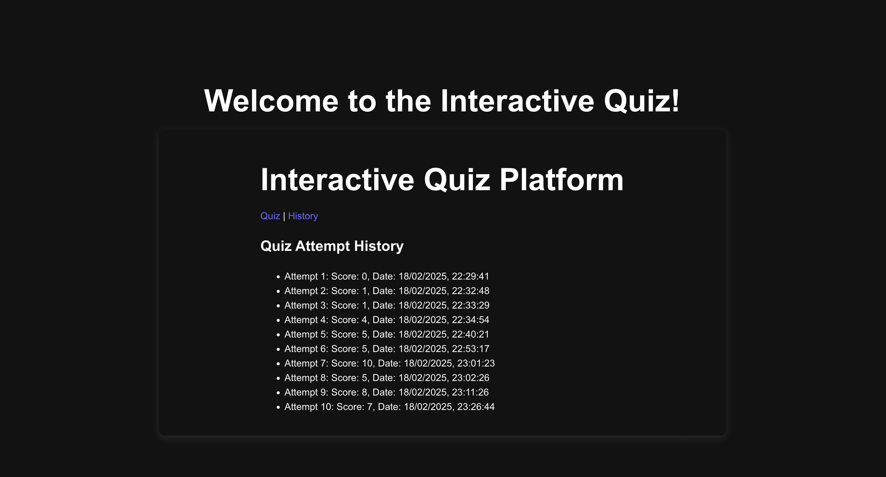

# **Interactive Quiz Platform**

An interactive quiz application built with **React** and styled with a sleek **Dark Theme**. Users can attempt quizzes, view instant feedback for their answers, track their scores, and view their attempt history.

---

## **Features**
- **Quiz Management**: Users can attempt multiple-choice and integer-based questions.
- **Instant Feedback**: Immediate response for correct or incorrect answers.
- **Per-Question Timer**: Each question is timed with a 30-second limit.
- **Global Timer**: The entire quiz has a 30-minute limit.
- **Score Summary**: View final scores at the end of the quiz.
- **Multiple Attempts**: Users can retake the quiz multiple times.
- **Attempt History**: Previous scores and attempt dates are saved using **IndexedDB**.
- **Dark Theme**: A modern dark theme for better readability and reduced eye strain.

---

## **How to Run the App Locally**

### **1. Clone the Repository**
```bash
git clone git@github.com:SAIKRISHNA239/Interactive-Quiz-Platform-.git
```

### **2. Navigate to the Project Directory**
```bash
cd Interactive-Quiz-Platform-
```

### **3. Install Dependencies**
Ensure you have **Node.js** installed, then run:
```bash
npm install
```

### **4. Start the Development Server**
```bash
npm start
```

- The app will be available at `http://localhost:5173`.

---

## **Deployment**
The app is deployed on **[Vercel](https://interactive-quiz-platform-bay.vercel.app/)**. Click the link to access the live version.

---

## **Screenshots **

### 1. **Quiz Interface**
This is the main interface of the quiz platform, showing a question and answer options.


---

### 2. **Answering Correctly (Multiple-Choice Question)**
The user answered a multiple-choice question correctly, and instant feedback is shown in green.


---

### 3. **Answering Incorrectly (Multiple-Choice Question)**
The user answered a multiple-choice question incorrectly, and feedback is shown in red.


---

### 4. **Answering Correctly (Integer Question)**
This screenshot shows a correct answer for an integer-type question with the corresponding feedback.


---

### 5. **Answering Incorrectly (Integer Question)**
The user provided an incorrect answer for an integer-type question, and feedback is displayed in red.


---

### 6. **Quiz Finished**
A summary screen is shown when the quiz is finished, displaying the final score.


---

### 7. **Viewing Quiz History**
The quiz history page shows previous quiz attempts along with the date and score for each attempt.


---

